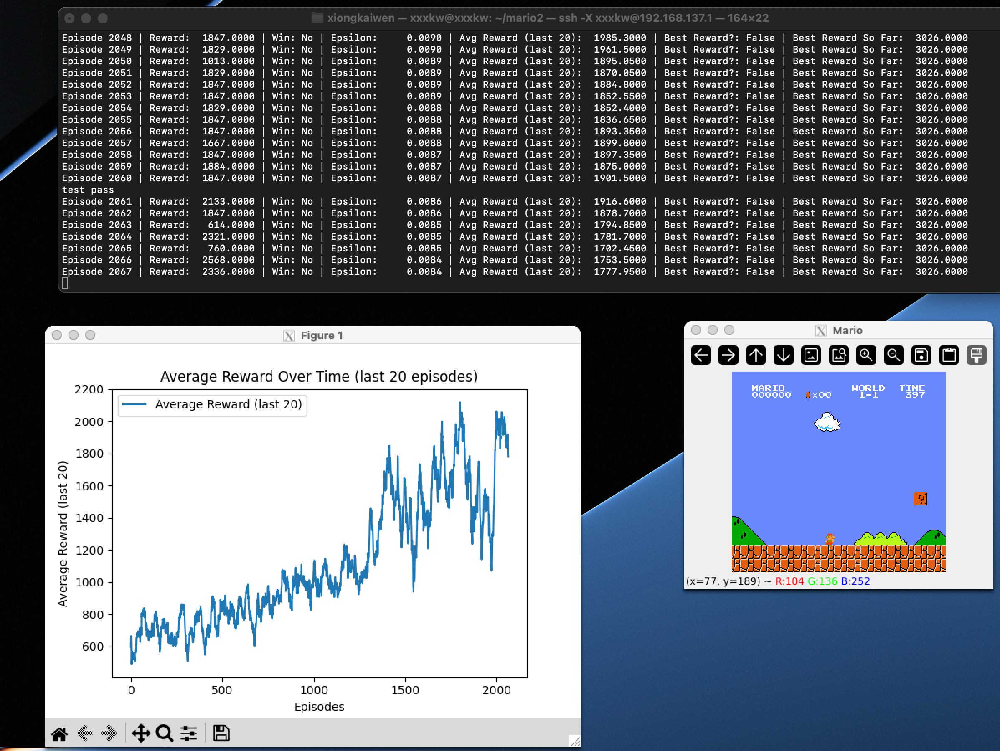
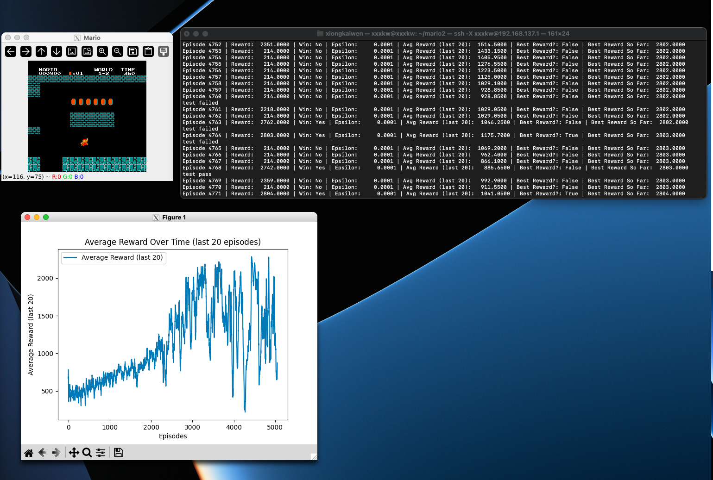

[中文版](README.md)
# Super Mario DQN Agent

This project implements a **DQN** agent to play **Super Mario**. The agent learns to maximize rewards through reinforcement learning and discovers optimal actions in the environment.

## Features
- **Gym Super Mario Bros Environment**: Uses the `gym-super-mario-bros` library to create the Mario environment.
- **DQN**: Implements DQN using PyTorch to train the agent.
- **Experience Replay Buffer**: Stores and samples game states to stabilize the training process.
- **Target Network**: A separate target network is used to improve training stability.
- **Epsilon-Greedy Strategy**: Balances exploration and exploitation during training.

## Installation

1. Clone this repository:
```bash
git clone https://github.com/xxxkkw/AI-Mario.git
```
2. Install the required dependencies:

pip install -r requirements.txt

Note: Be sure to strictly follow the versions in the environment to avoid bugs.
## File Structure
```bash
├── models/                 # Directory where saved models are stored
├── train.py                # Main training script
├── agent.py                # DQN agent implementation
├── run.py                  # Play the game using the agent
├── replay_buffer.py        # Experience replay buffer implementation
├── config.py               # Hyperparameter configuration
├── init_env.py             # Mario environment setup and wrappers
├── requirements.txt        # Python dependencies
├── final_model1-1.dat      # Pre-trained model for level 1-1
├── final_model1-2.dat      # Pre-trained model for level 1-2
└── README.md               # Project documentation
```
## Usage
### Pre-trained Model:
The project comes with a pre-trained model that you can use to play the game right away:
```bash
python run.py
```
If you want to train the model from scratch, use the `--level` argument to specify the level:
```bash
python train.py --level 1-1
```

There are two pre-trained models for levels 1-1 and 1-2. To play level 1-2, for example, run:
```bash
python run.py --level 1-2
```

If you have a partially trained model and want to continue training, use the `--model` argument to specify the path to your model:
```
python train.py --model path_to_your_model
```
Enjoy playing!


